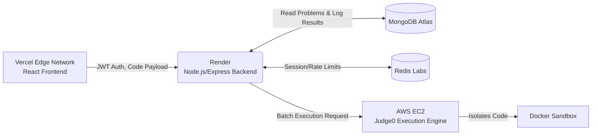

# Oncode | Code Execution Platform
[](https://oncode.vercel.app/)

> A highly scalable, secure code execution platform featuring real-time evaluation and isolated sandboxing.


---

## 🛠 The Tech Stack Matrix

| Layer | Technology | Purpose |
|-------|------------|---------|
| **Frontend** | React / Vite / Redux / TailwindCSS (Vercel) | Interactive UI, state management, and code editor interface. |
| **Backend API** | Node.js / Express (Render) | Request routing, JWT auth, business logic, and database orchestration. |
| **Database** | MongoDB / Redis | Persistent storage for users/problems, session caching, and rate limiting. |
| **Execution Engine** | Judge0 (AWS EC2) | Isolated Docker sandboxing for compiling and executing untrusted user code securely. |

---

## 🏗 System Architecture

Oncode is fundamentally a distributed system designed for high concurrency and secure execution of untrusted user input.

### The Data Flow
1. **Client Submission:** The frontend sends a JSON payload containing the user's source code and language ID to the backend via a secure, JWT-authenticated API endpoint.
2. **Backend Orchestration:** The backend verifies the user's identity, retrieves the problem's hidden test cases from MongoDB, and stitches the user's code into the language-specific "Driver Code" (which handles input/output parsing).
3. **Execution Engine Dispatch:** The backend packages the code and all test cases into a batched HTTP request and forwards it to the standalone Judge0 execution engine hosted on an isolated AWS EC2 instance.
4. **Sandboxed Evaluation:** Judge0 compiles and runs each test case inside a secure, ephemeral Docker container, preventing malicious loops or system access.
5. **Result Aggregation:** The backend continuously polls the Judge0 API for results. Once execution completes, it compares `stdout` against the expected output, compiles the final status (e.g., *Accepted, Wrong Answer, TLE*), logs the attempt in MongoDB, and returns the verdict to the frontend.

### Architecture Diagram


---

## ⚡ Technical Challenges & Trade-offs

### Security & Sandboxing
Running arbitrary, untrusted user code is inherently dangerous. If a user submitted `while(true) {}` or attempted to read system files (`fs.readFileSync('/etc/passwd')`), running it directly on the backend would immediately crash the server or compromise the database. 

**Solution:** I isolated the execution engine entirely. By hosting Judge0 on a separate AWS EC2 instance, all user code runs inside ephemeral Docker sandboxes with strict memory (`RLIMIT_AS`) and CPU time limits. Even if a script crashes the sandbox, the main Express backend and MongoDB database remain completely unaffected.

### Handling Asynchronous Execution
Code execution takes time. A single submission with 10 test cases cannot be executed instantly. If the backend blocked the HTTP thread while waiting for the execution to finish, it would quickly hit connection limits under load.

**Solution:** I implemented a polling architecture. The backend dispatches a batch submission and receives a list of unique `tokens`. It then asynchronously polls the Judge0 API using an exponential backoff strategy until all tokens return a terminal state (status > 2), ensuring the server remains responsive to other users.

---

## 🚀 Developer Onboarding

### Prerequisites
- [Node.js](https://nodejs.org/en/) (v20+)
- [Git](https://git-scm.com/)

### Environment Variables
You will need a MongoDB URI, a Redis cluster, and access to a Judge0 API instance.
Create a `.env` file in both the `frontend` and `backend` directories.

**Backend (`backend/.env`):**
```env
PORT=3000
MONGO_URI=mongodb+srv://<user>:<password>@cluster.mongodb.net/oncode
JWT_KEY=your_super_secret_key
REDIS_HOST=redis-xxxxx.cloud.redislabs.com
REDIS_PORT=xxxxx
REDIS_PASS=your_redis_password
JUDGE0_BASE_URL=http://your-judge0-instance:2358
JUDGE0_AUTH_TOKEN=your_judge0_token
CLIENT_URL=http://localhost:5173
```

**Frontend (`frontend/.env`):**
```env
VITE_API_URL=http://localhost:3000
```

### Local Setup Instructions

1. **Clone the repository**
   ```bash
   git clone https://github.com/your-username/oncode.git
   cd oncode
   ```

2. **Start the Backend**
   ```bash
   cd backend
   npm install
   npm run dev
   ```

3. **Start the Frontend** (in a new terminal tab)
   ```bash
   cd frontend
   npm install
   npm run dev
   ```

The application will be available at `http://localhost:5173`.
